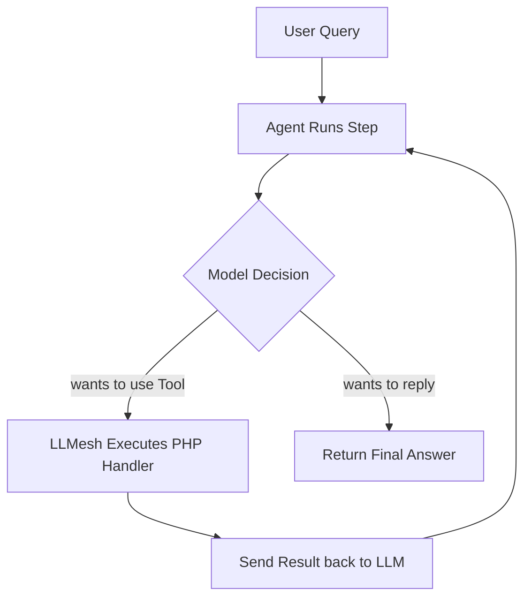

# Agents & Tools

An **Agent** is an autonomous LLM loop that can think, execute actions (using **Tools**), evaluate the results, and decide what to do next. Instead of just generating text, the model is given access to external functions, data databases, or custom PHP code.

---

## 1. Defining Tools

A **Tool** is a PHP object wrapping a function definition. It tells the LLM what parameters it expects and contains a handler closure that executes when the model calls the tool.

```php
use LLMesh\Core\Tools\Tool;

// Define a tool to calculate the cube of a number
$cubeTool = Tool::make('calculate_cube')
    ->description('Calculate the cube of a number. Use this whenever asked to raise a number to the power of 3.')
    ->parameters([
        'number' => Tool::integer('The number to cube')->required(),
    ])
    ->handler(function (array $params): array {
        // This PHP code runs when the LLM requests it
        $num = $params['number'];
        return ['result' => $num * $num * $num];
    });
```

---

## 2. Setting Up and Running the Agent

Initialize the `Agent` with a provider, system instructions, tools list, and execution limits:

```php
use LLMesh\Core\Agents\Agent;
use LLMesh\OpenAI\OpenAIProvider;

$provider = new OpenAIProvider($_ENV['OPENAI_API_KEY']);

$agent = Agent::make(
    provider:     $provider,
    systemPrompt: 'You are a helpful math assistant. Use the calculate_cube tool when asked.',
    tools:        [$cubeTool],
    maxSteps:     5 // Protects against infinite loops
)
// (Optional) Hook into the step execution loop to log what the agent is doing
->onStep(function ($step) {
    if (!empty($step->toolCalls)) {
        foreach ($step->toolCalls as $call) {
            echo "🤖 [Agent Action] Model called tool: '{$call->name}' with: " . json_encode($call->arguments) . "\n";
        }
    } else {
        echo "🤖 [Agent Action] Model decided to write the final response.\n";
    }
});

// Run the agent loop
$result = $agent->run('What is the cube of 6?');

// Print final output
echo "Final Answer: " . $result->finalText . "\n";
```

---

## 3. How the Agent Loop Operates

LLMesh automates the execution lifecycle:



This dynamic round-trip loop allows building advanced features like web scrapers, database managers, custom calculator helpers, or integrations with third-party APIs.
