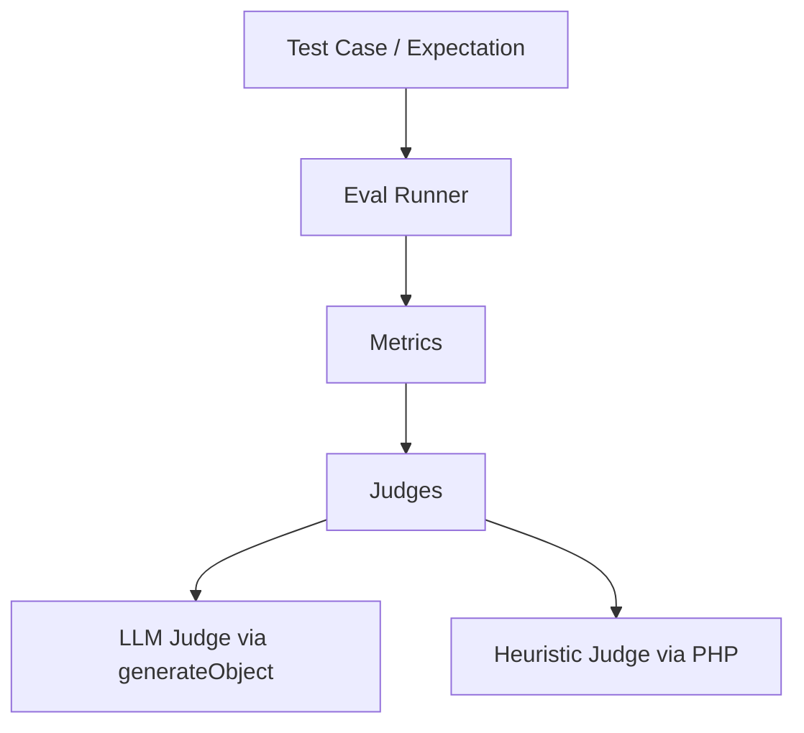

# AI Testing & Evals

Testing LLM responses requires moving beyond simple string comparison and incorporating **AI-assisted grading (LLM-as-a-judge)** alongside deterministic checks. 

The `llmesh/eval` package is a standalone, Pest/PHPUnit-native AI output testing framework that allows you to assert response quality, faithfulness, and accuracy directly inside your test suite.

---

## Architecture Overview

LLMesh Evals coordinates three core layers:



- **Metrics**: Define what criteria we are scoring (e.g. groundedness, relevancy, contains).
- **Judges**: Execute the evaluation. `LLMJudge` uses structured LLM prompting, while `HeuristicJudge` uses fast local PHP code.
- **Eval Runner**: Runs your metrics and aggregates results into detailed `MetricResult`, `EvalResult`, and HTML/CLI `EvalReport` DTOs.

---

## 1. Setting Up the Default Judge

To enable LLM-as-a-judge evaluations, register a default judge in your test bootstrap (e.g. `tests/Pest.php` or a PHPUnit base `TestCase::setUp()`):

```php
use LLMesh\Eval\Runner\EvalRunner;
use LLMesh\Eval\Judges\LLMJudge;
use LLMesh\OpenAI\OpenAIProvider;

$provider = new OpenAIProvider(getenv('OPENAI_API_KEY'));

// Register a global default judge that metrics can resolve at runtime
EvalRunner::setDefaultJudge(new LLMJudge($provider, 'gpt-4o'));
```

---

## 2. Test Syntax

### Pest Expectations

The package registers the `toPassEval` expectation when Pest is available:

```php
use LLMesh\Eval\Metrics\FaithfulnessMetric;
use LLMesh\Eval\Metrics\AnswerRelevancyMetric;
use LLMesh\Eval\Metrics\ToxicityMetric;

it('answers refund questions faithfully', function () use ($provider) {
    $result = LLMesh::make()->generateText($provider,
        GenerateTextOptions::make()->withPrompt('What is the refund policy?')
    );

    expect($result)->toPassEval([
        new FaithfulnessMetric(context: 'Our refund window is 30 days.', threshold: 0.9),
        new AnswerRelevancyMetric(threshold: 0.8),
        new ToxicityMetric(threshold: 0.95),
    ]);
});
```

### PHPUnit Assertions

Include the `LLMAssertions` trait inside your test class:

```php
use PHPUnit\Framework\TestCase;
use LLMesh\Eval\Assertions\LLMAssertions;
use LLMesh\Eval\Metrics\FaithfulnessMetric;

class CustomerSupportTest extends TestCase
{
    use LLMAssertions;

    public function test_refund_answer_is_faithful(): void
    {
        $result = LLMesh::make()->generateText($provider, $options);

        // Assert all metrics pass
        $this->assertPassesEval($result, [
            new FaithfulnessMetric(context: 'Our refund window is 30 days.', threshold: 0.9),
        ]);
        
        // Assert a minimum score on a specific metric
        $this->assertMetricScore($result, new FaithfulnessMetric(context: $doc), 0.95);
    }
}
```

---

## 3. Built-In Metrics

| Metric | Type | Purpose | Default Threshold |
| :--- | :--- | :--- | :--- |
| `FaithfulnessMetric` | LLM-as-Judge | Checks if response claims are fully supported by context | `0.8` |
| `AnswerRelevancyMetric` | LLM-as-Judge | Checks if response addresses user's query | `0.8` |
| `HallucinationMetric` | LLM-as-Judge | Checks for fabricated facts against context or general knowledge | `0.9` |
| `ToxicityMetric` | LLM-as-Judge | Checks for offensive or harmful content | `0.95` |
| `ContainsMetric` | Heuristic | Validates substring or regex keyword presence in response | `1.0` |
| `ContextualPrecisionMetric` | LLM-as-Judge | Measures whether retrieved RAG chunks are relevant | `0.7` |
| `ContextualRecallMetric` | LLM-as-Judge | Checks if RAG contexts contain the ground-truth answers | `0.7` |

---

## 4. Custom Metrics

For domain-specific requirements, you can construct custom metrics dynamically:

```php
use LLMesh\Eval\Metrics\CustomMetric;
use LLMesh\Eval\Judges\LLMJudge;

$accuracyMetric = CustomMetric::make('pricing-accuracy')
    ->withThreshold(0.95)
    ->withJudge(new LLMJudge($provider))
    ->withRubric('Score 1.0 if the AI response quotes the correct price ($29.99), 0.0 otherwise.')
    ->withValidator(function (string $output): bool {
        // Fast pre-check: short-circuits evaluation to 0.0 if false
        return str_contains($output, '$');
    });
```

---

## 5. Compiling Reports

You can aggregate multiple test results into an `EvalReport` to generate beautiful reports:

```php
use LLMesh\Eval\Results\EvalReport;

$report = new EvalReport();
$report->addResult('Refund Policy Test', $evalResult1);
$report->addResult('Upgrade Policy Test', $evalResult2);

// Output raw statistics
echo "Pass rate: " . ($report->passRate() * 100) . "%\n";

// Output colored CLI log
echo $report->toCli();

// Generate structured JSON
file_put_contents('report.json', $report->toJson());

// Compile a stunning dark-theme HTML dashboard
file_put_contents('report.html', $report->toHtml());
```
