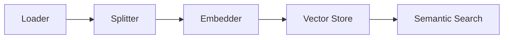

# Retrieval-Augmented Generation (RAG)

**Retrieval-Augmented Generation (RAG)** is a pattern where you load external knowledge (e.g. documentation, database records, PDFs), split it into small chunks, generate vector representations (embeddings) for each chunk, and store them in a vector database. When a user asks a question, you retrieve the most semantically relevant chunks and feed them to the LLM as context, resulting in highly accurate answers.

LLMesh includes a built-in RAG ingestion and retrieval pipeline.

---

## The RAG Pipeline Architecture

LLMesh organizes RAG into a fluent `Pipeline` wrapping four core components:



---

## 1. Configuring and Running Ingestion

To ingest documents, prepare your source texts and metadata, initialize the pipeline components, and invoke `$pipeline->run()`:

```php
use LLMesh\Core\RAG\Pipeline;
use LLMesh\Core\RAG\Loaders\ArrayLoader;
use LLMesh\Core\RAG\Splitters\RecursiveCharacterSplitter;
use LLMesh\Core\RAG\VectorStores\InMemoryVectorStore;
use LLMesh\OpenAI\OpenAIProvider;

$texts = [
    'LLMesh is a lightweight PHP SDK designed for building modular AI applications.',
    'RAG splits text documents, embeds them, and retrieves top matching chunks.',
    'For organic gardening, plant potatoes in well-drained, compost-rich soil.',
];

$metadata = [
    ['category' => 'tech'],
    ['category' => 'wiki'],
    ['category' => 'gardening'],
];

// 1. Initialize Components
$loader = new ArrayLoader($texts, $metadata);
$splitter = new RecursiveCharacterSplitter(chunkSize: 100, overlap: 10);
$provider = new OpenAIProvider($_ENV['OPENAI_API_KEY']); // Generates embeddings
$vectorStore = new InMemoryVectorStore(); // Stores vectors in memory

// 2. Build the Pipeline
$pipeline = Pipeline::make()
    ->load($loader)
    ->split($splitter)
    ->embed($provider) // Uses text-embedding-3-small under the hood
    ->store($vectorStore)
    ->onProgress(function (int $done, int $total) {
        echo "Ingested chunk {$done} of {$total}\n";
    });

// 3. Ingest documents into the Vector Store
$result = $pipeline->run();

echo "Ingested {$result->chunksStored} vector chunks successfully!\n";
```

---

## 2. Querying & Semantic Retrieval

Once the vector store is populated, you can query it semantically. The pipeline embeds the natural language query and performs a cosine similarity lookup against the stored vectors:

```php
$query = "Tell me about LLMesh and RAG in PHP";
echo "Searching Vector Store for: \"{$query}\"...\n";

// Retrieve top 2 most matching document chunks
$retrievedDocs = $pipeline->retrieve($query, topK: 2);

foreach ($retrievedDocs as $idx => $doc) {
    echo "\nRank " . ($idx + 1) . " (ID: {$doc->id}):\n";
    echo "  Content:  \"" . trim($doc->content) . "\"\n";
    echo "  Metadata: " . json_encode($doc->metadata) . "\n";
}
```

You can now format these retrieved chunks as context and append them to your prompt inside `GenerateTextOptions` to give your LLM instant access to your private database!
